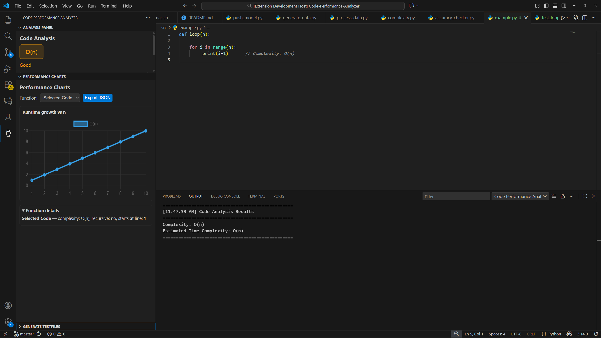
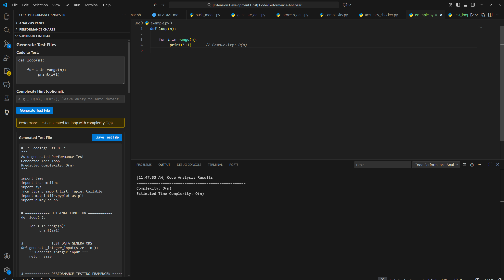
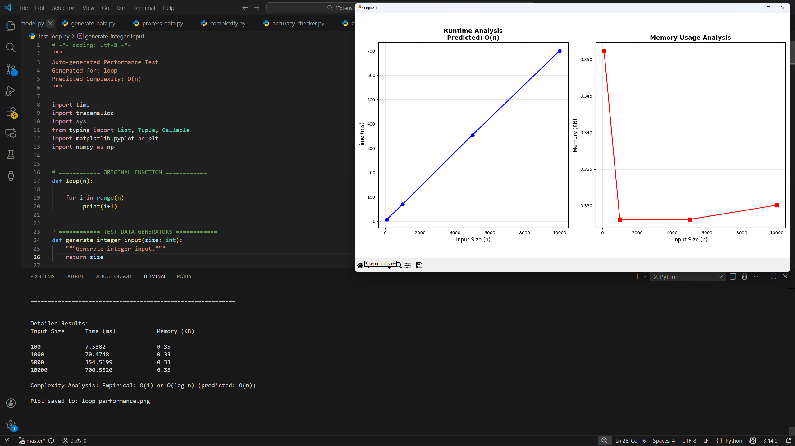

# Code Performance Analyzer (CPA)

## Overview

Code Performance Analyzer is a Visual Studio Code extension that helps developers analyze code performance and automatically generate performance tests. It combines static complexity analysis with empirical benchmarking to predict complexity, produce performance tests, and visualize results.

Use cases:
- Quickly assess runtime/memory complexity of functions
- Generate performance tests for real-metric time and space performance
- Visualize runtime growth at scale
- Export performance overviews and test results





## Requirements

- OS: Windows / Linux / macOS (development files and batch scripts assume Windows PowerShell)
- Python 3.9+ (backend server and utilities)
- Node.js (for VS Code extension build steps)
- Docker Desktop (recommended for dev container)
- Optional: NVIDIA GPU drivers + Docker with GPU support for model hosting
- Optional: Kubernetes-In-Docker (Kind, for cluster deployment)


## How to Run

## Set up the Repository:
1. Clone the repository
2. Clone the repository: `cd src/model/models/student && git clone https://huggingface.co/philippesic/cpa`

## Run from Dev Container

Running the model from a dev containers allows for GPU inference, which is much faster than the cluster, but requires a CUDA-capable GPU with >10GB VRAM

1. Enter the container: `dev.bat`
2. Start the server: `bash serve.sh`
3. Confirm the server is running: `curl 127.0.0.1:5000/health`
4. Compile the extension in the root directory: `npm run compile`
5. Enter the VSCode test environment by running F5 from `src/extension/extension.ts` (Using Visual Studio Extension Development)
6. Open the repository and experiment on the provided test functions (or your own)

## Run from Cluster

Running the model from a cluster currently only supports CPU inference, which is slower, but works with a much wider range of hardware

1. Start (Or Create a new) cluster: `cicd/start_deploy.bat`
2. Update the cluster image to the most recent version: `cicd/update_cluster.bat`
3. The server will automatically deploy. Enter the test environment and experiment with the extension

# Usage

## Analyze Code Complexity

Within the test environment, highlight a Python code snippet -> Right Click -> Analyze Code Complexity

## Performance Charts

Automatically render in the sidebar upon analysis

## Performance Tests

Paste a Python Function into the Performance Test input in the sidebar and click generate. Save the provided file and run it.

## Export JSON

Upon generating a performance test, click Export JSON and save the file

## Export CSV

Open the command pallete and select CPA: Export as CSV

# Repository Layout
```
├───cicd
├───demo
├───dist
└───src
    ├───extension
    └───model
        ├───build
        ├───data
        ├───examples
        ├───exported_results
        ├───models
        │   └───student
        │       ├───adapters
        │       ├───base
        │       └───cpa
        ├───stub-server
        ├───tree-sitter-python
        └───utils
```